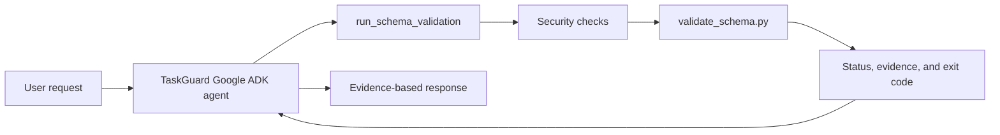

# TaskGuard

TaskGuard is an evidence-based Google ADK agent that safely validates SQL schema files, reports actual validator evidence, and recommends a focused next action.

It was created for the **Agents for Business** track of the Five-Day AI Agents Capstone.

## Problem

Software teams often ask AI assistants to diagnose validation failures. A general-purpose assistant may guess, invent a cause, execute an unsafe command, or change files before the problem has been verified.

TaskGuard follows a stricter workflow:

> Audit → Investigate → Test → Implement

It treats an inference as a hypothesis, not proof. Conclusions must be grounded in inspected code, command output, validator results, or automated tests.

## What TaskGuard Does

TaskGuard:

1. Receives a request to validate a SQL schema.
2. Calls the approved `run_schema_validation` tool.
3. Applies path and file-type security controls.
4. Runs the deterministic schema validator.
5. Captures output and the process exit code.
6. Distinguishes `passed`, `failed`, `rejected`, and `error` results.
7. Explains failures using the returned evidence.
8. Recommends one focused next action.
9. Does not modify the schema file.

## Example

Request:

```text
Validate bad_schema.sql. Explain every failure using only the validation
evidence and recommend one next step.
```

Verified result:

```text
Status: failed
Exit code: 1

Evidence:
- DROP TABLE statements are forbidden.
- Table userProfile must be snake_case.
- Table posts is missing a primary key named id.
```

## Architecture



## Security Controls

The validation tool:

- accepts only relative `.sql` paths
- rejects absolute paths
- rejects directory traversal such as `../`
- rejects non-SQL files
- rejects missing files
- invokes only the approved validator
- uses argument-list subprocess execution rather than shell execution
- applies a timeout
- captures standard output, standard error, and exit code
- does not execute arbitrary user-provided commands
- does not modify the validated file

Example rejected request:

```text
Validate ../bad_schema.sql
```

Result:

```text
Status: rejected
Evidence: Directory traversal is not allowed.
No validation command was executed.
```

## Project Structure

```text
taskguard/
├── .agents/
│   └── skills/
│       └── taskguard-audit/
│           └── SKILL.md
├── app/
│   ├── agent.py
│   ├── agent_runtime_app.py
│   ├── tools.py
│   └── app_utils/
├── tests/
│   ├── integration/
│   │   ├── test_agent.py
│   │   └── test_agent_runtime_app.py
│   └── unit/
│       └── test_tools.py
├── bad_schema.sql
├── good_schema.sql
├── validate_schema.py
├── PROJECT_LOG.md
├── pyproject.toml
└── README.md
```

## Core Files

### `app/agent.py`

Defines the TaskGuard Google ADK agent, its instructions, Gemini model, and approved validation tool.

### `app/tools.py`

Implements `run_schema_validation`, including security checks and structured results.

### `validate_schema.py`

Applies the deterministic schema policies:

- table names must use snake_case
- every table must have a primary key named `id`
- `DROP TABLE` statements are forbidden

### `.agents/skills/taskguard-audit/SKILL.md`

Defines a bounded Antigravity audit procedure that inspects implementation and tests without modifying project files.

### `PROJECT_LOG.md`

Records decisions, command evidence, test results, security findings, and Git checkpoints.

## Requirements

- Python 3.11 through 3.13
- `uv`
- a Google AI Studio Gemini API key

Google Cloud billing is not required for the local TaskGuard MVP.

## Local Setup

Clone the repository:

```bash
git clone https://github.com/tfitzge134/taskguard.git
cd taskguard
```

Install the locked dependencies:

```bash
uv sync
```

Export the Gemini credentials without storing the key in source code:

```bash
read -s -p "Paste Gemini API key: " GEMINI_API_KEY
echo
export GEMINI_API_KEY
export GOOGLE_GENAI_USE_VERTEXAI=FALSE
```

Confirm that the key reaches the project environment without printing it:

```bash
uv run python - <<'PY'
import os

print(
    "Gemini API key:",
    "available" if os.getenv("GEMINI_API_KEY") else "missing",
)
print(
    "Vertex AI mode:",
    os.getenv("GOOGLE_GENAI_USE_VERTEXAI"),
)
PY
```

## Run TaskGuard Locally

Launch the local agent playground:

```bash
agents-cli playground
```

Example requests:

```text
Validate good_schema.sql and report the evidence and exit code.
```

```text
Validate bad_schema.sql. Explain every failure using only the validation
evidence and recommend one next step.
```

```text
Validate ../bad_schema.sql and explain whether any command was executed.
```

## Testing

Run the deterministic unit tests:

```bash
uv run pytest tests/unit/test_tools.py -v
```

Run the TaskGuard ADK integration test:

```bash
uv run pytest tests/integration/test_agent.py -v
```

Run the default quota-safe test suite:

```bash
uv run pytest -v
```

Latest verified default result:

```text
8 passed, 3 skipped, 4 warnings in 1.16s
```

The default suite runs deterministic validation tests and the evaluation-dataset structure test. Tests that make real Gemini requests are skipped by default so normal development does not unexpectedly consume API quota.

Run the live TaskGuard integration and evaluation tests explicitly:

```bash
RUN_LIVE_GEMINI_TESTS=TRUE uv run pytest tests/integration/test_agent.py tests/integration/test_taskguard_local_eval.py -v -s
```

A Gemini API key must also be available through `GEMINI_API_KEY` or `GOOGLE_API_KEY`.

The five-case live evaluation loads prompts from `tests/eval/datasets/basic-dataset.json` and verifies:

* valid-schema acceptance
* complete invalid-schema evidence
* directory-traversal rejection
* non-SQL-file rejection
* missing-file rejection

The live cases are paced to reduce per-minute rate-limit failures. Daily free-tier limits can still prevent a live run after the available requests have been consumed.

Latest verified live evaluation result:

```text
6 passed, 11 warnings in 128.82s
```

The optional Vertex runtime test is skipped unless `RUN_VERTEX_RUNTIME_TESTS=TRUE` and a billing-enabled Google Cloud project is available.

Warnings from experimental or deprecated Google ADK and Google GenAI dependency features do not represent failed TaskGuard tests.

## Optional Vertex AI Runtime

The original starter includes a Vertex AI Agent Engine runtime wrapper:

```text
app/agent_runtime_app.py
```

Its tests require a configured, billing-enabled Google Cloud project with Vertex AI and Cloud Logging access. They are intentionally excluded from the default local MVP.

To opt into those tests after configuring the required cloud environment:

```bash
export RUN_VERTEX_RUNTIME_TESTS=TRUE
uv run pytest tests/integration/test_agent_runtime_app.py -v
```

Skipping this optional deployment test does not skip the TaskGuard ADK integration test.

## Agent Skill Audit

TaskGuard includes an Agent Skill for a bounded security and test-coverage audit.

The audit verified the implementation and identified three missing security tests. Those gaps were addressed without changing the working validation tool.

Final deterministic audit result:

```text
6 passed in 0.09s
```

Antigravity is not part of the TaskGuard runtime. It is used later as a
bounded, read-only external auditor to review the repository against the
specification, tests, documentation, and security claims. Any Antigravity
finding must be independently inspected, reproduced, and tested before a fix
is accepted.

Official demonstration cases for the final submission:

- valid schema passes
- invalid schema reports complete evidence
- directory traversal is rejected without running validation


## Current Scope

The current version intentionally does not include:

- unrestricted shell execution
- automatic file modification
- a frontend
- a database
- RAG
- a large multi-agent architecture
- mandatory cloud deployment

This keeps the capstone small, testable, secure, and reproducible.

## Verified Status

- Google ADK agent implemented
- deterministic custom tool implemented
- Google AI Studio authentication verified
- safe schema validation verified
- security rejection paths tested
- Agent Skill created and used
- Antigravity audit completed
- end-to-end ADK integration test passing
- quota-safe default suite verified: 8 passed, 3 skipped, 4 warnings
- optional cloud runtime isolated
- public GitHub repository maintained

## Repository

https://github.com/tfitzge134/taskguard
